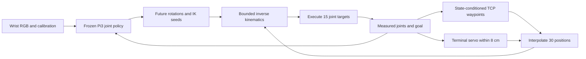

# Methodology: Hybrid Cartesian and Visual Joint Planning for Table Scene Navigation

This section describes the implemented method in `gtsn_cartesian_20261003`,
using the model source preserved before test evaluation and the final frozen
policy specification. The selected configuration is
`state_e15_s0.08_obaseline`: a state-conditioned Cartesian waypoint decoder,
a frozen RGB-conditioned joint policy for wrist orientation and inverse
kinematics initialization, and a terminal goal servo. The experiment records
**72 successes in 100 test episodes (72%)**, with 80% validation success.
The uncertainty and memory extensions below are evaluated variants of the
Cartesian decoder; they are not components of the selected waypoint branch.

## 1. Problem formulation and observations

We consider goal-directed motion of a seven-degree-of-freedom Panda arm in
table scenes. At observation time $t$, the policy receives a wrist-camera RGB
image $I_t$, measured arm angles $q_t\in\mathbb R^7$, two finger positions
$f_t\in\mathbb R^2$, a requested goal pose $(g,R_g)$, camera intrinsics $K$, and
the measured camera-to-robot-base transform $T^B_{C,t}$. Time indices are
measured in control steps. All Cartesian positions and robot transforms are
expressed in the robot base frame. The deployment
inputs contain no measured depth, object descriptions, route labels, expert
future trajectory, or expert progress index. Scene descriptions are used by
the simulator to render observations and evaluate physical contacts.

The robot and goal are represented by a 16-dimensional state vector,

$$
s_t=\left[
\frac{q_t}{\pi},\;
\frac{f_t}{0.04},\;
\operatorname{clip}\!\left((g-c)\oslash d,-2,2\right),\;
\bar u_g
\right],
\tag{1}
$$

where $c=(0.65,0,0.22)$ m, $d=(0.55,0.55,0.50)$ m, and $\oslash$ denotes
elementwise division. The goal quaternion $\bar u_g$ uses the $wxyz$ order,
is normalized to unit length, and has a nonnegative scalar component. The
Cartesian controller recovers the goal position from the normalized XYZ
entries using the same center and scales.

The policy predicts a chunk of $H=30$ arm targets and executes its first
$E=15$ targets before observing again. Control runs at 20 Hz, giving a
1.5-second prediction horizon and a 0.75-second execution horizon. Each
predicted joint displacement is relative to the joint configuration measured
at the beginning of the chunk; it is not a cumulative increment.

## 2. Frozen visual and geometry backbone

We reuse the trained Pi3 map-policy checkpoint selected at epoch seven of the
preceding RGB perturbation experiment. Its image encoder was initialized from
published Pi3 encoder weights; the small decoder and policy heads were
initialized and trained in that preceding experiment. During the Cartesian
experiment, the entire checkpoint is frozen and evaluated without dropout.

The backbone resizes RGB to $84\times112$, applies ImageNet normalization,
and encodes the image with a DINOv2 ViT-L/14 encoder. A learned projection maps
the encoder's 1,024-dimensional patch features to a 384-dimensional,
24-block Pi3 small decoder with six attention heads per block. Concatenating
the outputs of the last two decoder blocks produces 768-dimensional spatial
features. An MLP with dimensions
$41\rightarrow384\rightarrow768$ adds a common conditioning vector formed
from $s_t$, the 16 flattened camera-transform entries, and nine intrinsic
entries. The first two rows of $K$ are normalized by the original sensor
image width and height, respectively.

Three prediction heads convert these features into six $80\times80$ maps:
normalized base-frame point XYZ, projected-goal relevance, visible-goal
relevance, and future-action relevance. Point coordinates are bounded by
$2\tanh(\cdot)$; the three relevance channels use sigmoid outputs. The
future-action map is predicted from the current observation and conditioning,
rather than supplied from an expert trajectory at deployment.

A residual CNN with channel widths $(32,64,128,192)$ encodes the predicted
maps, projects pooled spatial features to 384 dimensions, and combines them
with a 128-dimensional state embedding. Its frozen action head outputs

$$
A_t^B=B_\phi(I_t,s_t,K,T^B_{C,t})\in\mathbb R^{30\times7},
\qquad |A^B_{t,h,j}|\leq0.75\ \text{rad}.
\tag{2}
$$

Adaptive average pooling also extracts 16 spatial feature tokens
$v_{t,i}\in\mathbb R^{768}$ and corresponding six-channel geometry tokens
$\gamma_{t,i}=[p_{t,i},\ell_{t,i}]\in\mathbb R^6$ on a $4\times4$ grid.
Here $p_{t,i}$ is normalized predicted XYZ and $\ell_{t,i}$ contains the
three predicted relevance values. Visual decoder features therefore provide
a direct input to the new decoder alongside the explicit maps.

## 3. Task-relative Cartesian waypoint decoder

The new decoder predicts six tool center point (TCP) displacements at control-step offsets
$h_k=5k$, $k=1,\ldots,6$. Let calibrated forward kinematics give

$$
T_t=F(q_t)=\begin{bmatrix}R_t&x_t\\0&1\end{bmatrix}.
$$

The task query is

$$
z_t=Q_\theta\!\left(
[s_t,\operatorname{vec}(T_t),(g-x_t)/0.3]
\right)\in\mathbb R^{256},
\tag{3}
$$

where $Q_\theta$ is a $35\rightarrow256$ linear layer followed by SiLU and
LayerNorm. Supplying current TCP pose and relative goal displacement exposes
the kinematic task variables directly to the route decoder.

For a contextual frame at time $\tau\leq t$, each visual token is projected
through LayerNorm, a $768\rightarrow64$ linear layer, and SiLU. Each geometry
token is projected through a $6\rightarrow32$ linear layer and SiLU. The 16
concatenated visual/geometry embeddings retain their spatial order and are
flattened into 1,536 entries. Concatenating camera pose and normalized age
$a_{t,\tau}=(t-\tau)/60$ produces a 1,553-dimensional frame descriptor, which
a linear layer, SiLU, and LayerNorm map to $b_{t,\tau}\in\mathbb R^{256}$.

A single task-conditioned attention operation retrieves frame context:

$$
\alpha_{t,\tau}
=\operatorname{softmax}_{\tau}\!\left(
\frac{z_t^\top W_Kb_{t,\tau}}{\sqrt{256}}
\right),
\qquad
c_t=\sum_{\tau}\alpha_{t,\tau}b_{t,\tau}.
\tag{4}
$$

Unavailable history slots receive negative-infinite attention logits. The
output MLP has dimensions $512\rightarrow256\rightarrow128\rightarrow18$,
with SiLU after its first two layers, and predicts

$$
\widehat D_t
=0.3\tanh\!\left(O_\theta([z_t,c_t])\right)
\in\mathbb R^{6\times3}.
\tag{5}
$$

The bound is applied independently to each displacement coordinate, in meters.
These outputs specify positions relative to the current TCP, not residuals
added to a baseline Cartesian trajectory.

### 3.1 Decoder variants

All four conditions instantiate the same 691,768-parameter architecture and
receive the same training sample order. Their functional differences are:

| Variant | Context used for waypoint prediction | Geometry treatment | Observation history |
| --- | --- | --- | --- |
| State | $c_t=0$ | No geometry input affects waypoints | Current state and TCP pose |
| Visual | Current-frame descriptor | Original predicted points and relevance | Current observation |
| Uncertainty | Current-frame descriptor | Corrected points and reliability-gated visual features | Current observation |
| Memory | Attention over frame descriptors | Same uncertainty treatment | Up to four observed frames |

In the selected **state** variant, Eq. (5) depends on the query alone. The
unused context modules remain allocated for architectural matching. The full
selected controller still depends on RGB through Eq. (2), which supplies
future wrist orientations and IK initialization as described in Section 4.

### 3.2 Probabilistic pooled geometry

For the uncertainty and memory variants, a $64\rightarrow6$ distribution
head produces a point correction $d_{\tau,i}$ and variance parameter
$r_{\tau,i}$. The modeled pooled point distribution is diagonal Gaussian:

$$
\mu_{\tau,i}=p_{\tau,i}+0.25\tanh(d_{\tau,i}),
\qquad
\lambda_{\tau,i}=\log\sigma^2_{\tau,i}
=-5+4\tanh(r_{\tau,i}).
\tag{6}
$$

The geometry embedding uses $[\mu_{\tau,i},\ell_{\tau,i}]$. Visual features
are multiplied by within-frame reliability weights,

$$
w_{\tau,i}=16\,
\operatorname{softmax}_{i}\!\left(
-\frac12\operatorname{mean}_{j}
[\operatorname{stopgrad}(\lambda_{\tau,i,j})]
\right).
\tag{7}
$$

Thus the mean spatial weight is one. Detaching the log variance in this gate
prevents the action objective from changing variance merely to increase a
token's weight; variance receives supervision from the geometry likelihood.
The current-frame RMS standard deviation is recorded as a diagnostic, but
the Cartesian policy uses fixed 15-step execution and does not adapt sensing
frequency from this statistic.

### 3.3 Causal keyframe memory

The memory variant retains at most four actual observations, including the
current frame. Each stores frozen visual and geometry tokens, its measured
camera pose, and the control step at which it was observed. The history is
cleared at every episode reset. During training, prior expert frames are
chosen at or before offsets of 15, 30, and 45 control steps within the same
episode; the stride-two cache can make the actual offsets slightly larger.
Missing slots are masked. Perturbation samples use only their actual current
observation because no observed history is available for them.

The memory decoder attends over frame embeddings rather than fusing points
into an occupancy grid. Age is an input to the frame MLP; this Cartesian
implementation has no separate novelty feature or explicit recency penalty.
Those features belong to the earlier joint-residual pilot. Single-frame
visual and uncertainty variants retain only the newest frame before decoding.

## 4. Hybrid kinematic execution

The controller combines the learned Cartesian route with the frozen model's
joint-space predictions. This decomposition permits the new branch to learn
TCP translations while retaining visually conditioned wrist motion and
configuration information.

### 4.1 Interpolating Cartesian targets

Let $\widehat D_{t,0}=0$. Piecewise linear interpolation through displacement
knots at steps $0,5,\ldots,30$ constructs one target for every future control
step. For $h\in\{1,\ldots,30\}$, define
$k=\min(\lfloor h/5\rfloor,5)$ and $\beta=h/5-k$. Then

$$
\widehat x_{t,h}
=x_t+(1-\beta)\widehat D_{t,k}
+\beta\widehat D_{t,k+1}.
\tag{8}
$$

### 4.2 RGB-conditioned orientation and IK initialization

For each horizon step, the frozen joint prediction defines a candidate
configuration and corresponding rotation:

$$
q^B_{t,h}=\operatorname{clip}(q_t+A^B_{t,h},q_{\min},q_{\max}),
\qquad
R^B_{t,h}=\operatorname{rot}(F(q^B_{t,h})).
\tag{9}
$$

Outside the terminal-servo region, IK is initialized independently at
$q^B_{t,h}$ and tracks the target pose
$(\widehat x_{t,h},R^B_{t,h})$. The Cartesian positions predicted by the
baseline are not used as route targets. A fixed-orientation control instead
uses $q_t$ as initialization and $R_t$ as target rotation. The final selected
configuration uses Eq. (9).

### 4.3 Bounded damped least-squares inverse kinematics

Forward kinematics and the geometric Jacobian are computed from the Panda
URDF chain ending at `panda_hand_tcp`, including fixed transforms. This module
uses measured arm angles and robot calibration, with no scene-state input.
For a current IK iterate $q$, target $(\widehat x,\widehat R)$, and rotation
matrix columns $R_{:,j}$, the pose error is

$$
e(q)=\begin{bmatrix}
\widehat x-x(q)\\
\frac12\sum_{j=1}^{3}R(q)_{:,j}\times\widehat R_{:,j}
\end{bmatrix}.
\tag{10}
$$

With $W=\operatorname{diag}(1,1,1,0.3,0.3,0.3)$ and $\widetilde J=WJ(q)$,
the update is

$$
\delta q=\widetilde J^\top
\left(\widetilde J\widetilde J^\top+10^{-4}I_6\right)^{-1}We(q).
\tag{11}
$$

The update is rescaled to satisfy $\|\delta q\|_\infty\leq0.12$ rad, and the
resulting joint vector is clamped to a 0.01-rad margin inside the URDF limits.
The solver performs 12 iterations for all 30 targets in a batch using FP32.
It returns $\widehat q_{t,h}$, and the policy exports
$\widehat q_{t,h}-q_t$ for the common action interface. The simulator adds
these displacements to the original measured anchor and applies absolute
joint-position targets. The two fingers retain their initial positions.

### 4.4 Terminal goal servo

At each observation, if $\|g-x_t\|_2<r_s$ with $r_s=0.08$ m, the controller
replaces the learned route with a straight Cartesian interpolation,

$$
\widehat x^{\mathrm{servo}}_{t,h}
=x_t+\frac{h}{30}(g-x_t),\qquad h=1,\ldots,30.
\tag{12}
$$

In this region, all IK targets use the current wrist rotation $R_t$ and are
initialized at the measured configuration $q_t$. The servo is recomputed
after each executed prefix; the switch is evaluated at observation times,
rather than continuously within a chunk. The same terminal controller is
applied to the comparison policies. Its 8-cm activation radius leaves the
benchmark's 1-cm success threshold unchanged. The straight segment is not
checked against an obstacle model, and retaining current wrist orientation
does not enforce the requested goal orientation.

## 5. Supervision and optimization

### 5.1 Cartesian imitation targets

The decoder reuses the first pilot's frozen-feature cache. For each sample,
the cached expert or recovery target $A^*_{t,h}$ is an arm displacement from
that sample's measured configuration. We derive waypoint labels using the
same calibrated kinematics as the controller:

$$
D^*_{t,k}
=\operatorname{pos}\!\left(F(q_t+A^*_{t,5k})\right)-x_t,
\qquad k=1,\ldots,6.
\tag{13}
$$

Known terminal configurations are repeated when the expert future ends
before the 30-step horizon. These endpoint holds remain supervised. All six
waypoints and three coordinates have equal weight in the Cartesian loss;
the earlier pilot's joint-space horizon weighting is not used here.

The waypoint objective is the elementwise Huber loss averaged over batch,
waypoints, and coordinates:

$$
\mathcal L_{\mathrm{wp}}
=\operatorname{mean}_{t,k,j}
\rho_{0.02}(\widehat D_{t,k,j}-D^*_{t,k,j}),
\qquad
\rho_\delta(e)=
\begin{cases}
\frac12e^2,&|e|\leq\delta,\\
\delta(|e|-\frac12\delta),&|e|>\delta.
\end{cases}
\tag{14}
$$

The threshold $\delta=0.02$ is in meters. Training operates on cached
features and waypoint predictions; gradients do not pass through the online
IK controller or update the frozen backbone.

### 5.2 Geometry likelihood supervision

For probabilistic variants, measured training depth is backprojected using
$K$ and $T^B_C$, normalized with the center and scales in Eq. (1), clipped,
and pooled to $4\times4$. The point label $y_{t,i}$ is the mean of the
corresponding teacher-map cell. A cell is admitted only when at least 99.9%
of its depth samples on the $80\times80$ grid are finite and within
$[0.02,2.0]$ m. The likelihood supervises the current frame, including when
historical frames are available:

$$
\mathcal L_{\mathrm{geo}}
=\frac{\displaystyle\sum_{t,i}m_{t,i}\sum_{j=1}^{3}
\frac12\left[
(y_{t,i,j}-\mu_{t,i,j})^2e^{-\lambda_{t,i,j}}
+\lambda_{t,i,j}
\right]}{3\max(\sum_{t,i}m_{t,i},1)}.
\tag{15}
$$

Here $m_{t,i}$ is the geometry-validity mask; the constant Gaussian term is
omitted. The total objective is

$$
\mathcal L=
\begin{cases}
\mathcal L_{\mathrm{wp}},&\text{state or visual},\\
\mathcal L_{\mathrm{wp}}+0.001\mathcal L_{\mathrm{geo}},
&\text{uncertainty or memory}.
\end{cases}
\tag{16}
$$

This models conditional error of pooled normalized coordinates. It does not
separate epistemic and aleatoric uncertainty, estimate occupancy, or give a
collision probability. Pooling may mix surfaces and obscure thin obstacles.

### 5.3 Data and matched training protocol

The TSN-1K episode split is fixed and disjoint: 800 training, 100 validation,
and 100 test episodes. Direct/over/side counts are 160/320/320 for training
and 20/40/40 for each held-out partition. Training contains 57,335 expert
frames cached at stride two and 2,997 RGB perturbation-recovery samples from
training episodes. Validation and test caches contain 14,420 and 14,606
expert frames, respectively. Perturbation RGB is rendered at the stored
perturbed robot state; no on-policy collection is added in this experiment.

Each epoch samples 57,335 observations with replacement. Expert/recovery
probabilities are 0.65/0.35, and direct/over/side probabilities within each
source are 0.20/0.40/0.40. For a sample $i$ in source $u$ and route $r$, its
sampling weight is $\pi_u\pi_r/n_{u,r}$, where $n_{u,r}$ is the number of
cached samples in that stratum. Identical per-epoch sampling hashes across
the four conditions verify matched sample order.

All Cartesian heads train for 30 epochs with seed 20261002, batch size 256,
AdamW at learning rate $3\times10^{-4}$, weight decay $10^{-4}$, cosine
learning-rate decay, and gradient-norm clipping at 1. CUDA projections use
bfloat16 autocast, while exported waypoint errors, probability arithmetic,
and kinematic computations use FP32.

## 6. Checkpoint selection and evaluation

Each head checkpoint is selected by minimum coordinatewise waypoint RMSE
over all validation frames,

$$
\mathrm{RMSE}_{\mathrm{wp}}
=\sqrt{\frac{1}{18N_{\mathrm{val}}}
\sum_{t,k,j}(\widehat D_{t,k,j}-D^*_{t,k,j})^2}.
\tag{17}
$$

This metric differs from the RMS Euclidean distance per waypoint by a factor
of $\sqrt3$. The state checkpoint is selected at epoch 27 with RMSE
0.016702 m; visual, uncertainty, and memory checkpoints are selected at
epoch 20 with RMSE 0.017284, 0.016911, and 0.016979 m, respectively.

Controller composition is then chosen using all 100 validation rollouts.
The final selection rule ranks success rate descending, collision rate
ascending, fewer newly trained parameters, and finally condition name.
This is the rule recorded in the frozen `selection.json` and implemented
in `report_cartesian.py`; the initial protocol's RMSE tie-break describes
an earlier plan. Waypoint RMSE still selects checkpoints within each head.
The state-waypoint/Pi3-orientation composition obtains 80% validation
success and is frozen before revision-2 test evaluation. The visually
conditioned Cartesian variants achieve 75%, 74%, and 79% validation success.

Closed-loop simulation uses 100 Hz physics, 20 Hz control, and a maximum of
400 control steps. Contacts are checked at every physics substep. Robot
contacts above $10^{-7}$ N·s trigger collision termination, excluding
adjacent self contacts and the fixed base/table mounting contact. An episode
succeeds only if the TCP reaches within 0.01 m of the goal without any
recorded collision. Goal-orientation error within 0.15 rad is reported
separately. Rollouts use live RGB and measured state; only the initial expert
state is used to initialize the simulator.

On the fixed test set, the selected composition achieves 72% XYZ success,
28% collisions, and no timeouts; simultaneous XYZ and orientation success
is 22%. Pi3 with the same terminal servo achieves 54% XYZ success. The paired
gain is 18 percentage points, with a 95% interval of 8–29 points from 20,000
paired episode bootstrap resamples and exact McNemar $p=0.00210$. This
comparison measures the change in route representation and kinematic
execution under a shared terminal servo. Relative to the historical
no-servo policy, improvements additionally include the terminal-controller
change.

The uncertainty and memory test rates are 79% and 76%, but neither replaces
the validation-selected model. Their incremental gains are not statistically
established in the recorded comparisons. The probabilistic heads provide
approximately 87.2% marginal coverage for nominal 95% intervals, so their
variance estimates remain overconfident. The study uses one Cartesian
training seed and a test split inspected in preceding experiments; these
results are exploratory and require a fresh confirmation set and additional
seeds for broader publication claims. The implemented method provides no
validated collision-avoidance guarantee, active viewpoint selection, or
end-to-end perception adaptation in this revision.

## Implementation and artifact references

The descriptions above were checked against the test-frozen source snapshot;
the current copies of the five principal model and runner files match that
snapshot byte for byte.

| Component | Repository source |
| --- | --- |
| Cartesian decoder, interpolation, terminal servo, FK/Jacobian/IK | [`cartesian_policy.py`](../src/tsn/models/cartesian_policy.py) |
| Frozen RGB encoder, Pi3 decoder, predicted maps, pooled features | [`pi3_policy.py`](../src/tsn/models/pi3_policy.py) |
| Frozen map-to-joint policy | [`geometry_policy.py`](../src/tsn/models/geometry_policy.py) |
| State normalization and teacher geometry | [`state.py`](../src/tsn/features/state.py), [`maps.py`](../src/tsn/features/maps.py) |
| Cartesian target construction, loss, training, policy composition | [`run_cartesian.py`](../scripts/run_cartesian.py) |
| Frozen feature cache and causal training histories | [`run_gtsn.py`](../scripts/run_gtsn.py) |
| Geometry NLL shared with the earlier pilot | [`gtsn_policy.py`](../src/tsn/models/gtsn_policy.py) |
| Endpoint holds and recovery observations | [`hdf5_dataset.py`](../src/tsn/data/hdf5_dataset.py), [`recovery_dataset.py`](../src/tsn/data/recovery_dataset.py) |
| Live rollout, action anchoring, and termination | [`closed_loop.py`](../src/tsn/evaluation/closed_loop.py), [`episode.py`](../src/tsn/simulation/episode.py) |
| Final selection and paired statistics | [`report_cartesian.py`](../scripts/report_cartesian.py) |

The experiment root is
`/run/user/1016/experiments/gtsn_cartesian_20261003`. Its
`selected_policy.json` records the exact composition and weight checksums;
`selection.json` preserves the validation decision; `heads/*/results.json`
and `epochs.json` record checkpoint selection and optimization;
`decoder_diagnostics.json` records waypoint and calibration measurements;
and `rollouts/{validation,test}/*/closed_loop.json` records episode outcomes.
The source used for test runs is preserved in
`provenance/test_frozen/source/`. The selected weights are
`heads/state/best.pt` together with the frozen backbone at
`/run/user/1016/experiments/pi3_small_perturbation10_20261002/train/best.pt`.
Additional results and reproduction commands appear in
[`gtsn_experiments.md`](gtsn_experiments.md).
