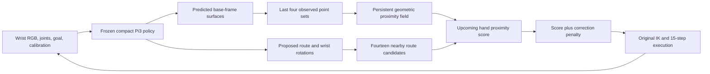

# GTSN: Geometry-Grounded Table Scene Navigation from a Moving RGB Camera

## Research story

**Central question: how can the weak geometry inferred from a single moving RGB
camera become a useful geometric basis for navigation decisions?**

A camera shows appearance; navigation depends on spatial relationships. The
robot needs to know where observed surfaces lie relative to its body, remember
those surfaces when its wrist turns, and determine whether its next motion will
pass too close to them. A predicted point map is only the beginning. Its geometry
must stay connected to the robot's coordinate system, observation history, and
physical motion.

We propose **geometry-grounded navigation through a persistent clearance field**.
The existing monocular backbone predicts surfaces in the robot base frame. A
short geometric memory retains those surfaces across views. Their proximity
field is then queried by the upcoming hand motion, yielding a geometric cost for
each candidate action. A learned route supplies task progress; bounded geometric
refinement uses the field to improve local clearance.

This gives one continuous chain:
**RGB → metric scene geometry → persistent geometric field → body-conditioned
motion cost → action.** Geometry is the intermediate representation that connects
perception to execution. The learned route supplies task progress, and bounded
refinement limits how strongly imperfect geometry changes the motion.

The baseline already predicts geometry, conditions on the goal, and remembers
visual features. Our contribution starts where those capabilities stop: make
predicted geometry an explicit spatial relation between remembered surfaces and
proposed robot motion. We do not claim a new monocular reconstruction backbone.

The established implementation obtains **85% validation and 83% exploratory test
success**, versus **82% and 78%** for the compact baseline. Side-route test success
increases from **52.5% to 67.5%**. The existing memory and hand-extent controls,
together with the new geometric-alignment interventions below, test whether the
geometry is doing useful work. The gain is modest and the fixed test set has
already informed method development; selection history and uncertainty remain
explicit in the experiments. The new learned mean-correction extension improves
validation to 86% but scores 82% on test, despite slightly better geometric error.
Consequently, the central finding concerns how geometry is retained and queried
for motion; improved reconstruction error alone is not claimed as the cause of
better navigation.

## Three challenges and corresponding contributions

### 1. Seeing a surface does not locate it relative to the robot

Image proximity is not physical proximity. A surface can appear close to the
hand in the image while lying at a different depth. Conversely, a small error in
metric position can change whether the hand clears an obstacle.

**Spatial grounding: a metric scene field in the robot frame.** Reuse the trained
backbone's base-frame point predictions and turn them into a continuous
surface-proximity field. The hand and the observed surfaces are evaluated in the
same coordinate system. A fixed 4 cm proximity scale softens the decision around
imperfect surface estimates. The implemented mean-correction update also brings
the frozen head's learned geometric residual into the explicit field. The new
matched controls shift only the clearance
surfaces by ±10 cm along base x; they preserve the frozen proposal and test the
importance of correct scene–robot alignment. These controls assess the field's
use of coordinates, not the absolute accuracy of reconstruction.

### 2. Geometry disappears from the image before it stops mattering

As the wrist moves, an obstacle can leave the field of view or become occluded.
Using only current surfaces makes the geometric description of a static scene
change unnecessarily. A feature memory does not directly supply the missing
surface coordinates needed for a clearance query.

**Temporal grounding: persistent surface geometry across views.** Retain four
observed point sets in the base frame and define the field over their union.
The current-surface-only control isolates this explicit memory while preserving
the baseline's feature memory. We additionally implement and test a visibility
update: preserve occluded or unmatched history, but discard a historical point
when a nearby current inferred ray extends substantially beyond it. This tests
whether geometry should be checked for consistency as well as accumulated.
Four views are bounded memory; no never-observed geometry is reconstructed.

### 3. A geometric scene description does not say which action will collide

The same surface can be irrelevant to one motion and critical to another.
Distance to a tool-center path also ignores the hand's extent. Geometry becomes
useful for control only when it describes the relationship between a specific
robot motion and the scene.

**Action grounding: query the geometric field with the swept hand.** Evaluate
three hand-axis points at five times in the upcoming executed horizon. This
converts the scene field into a candidate-specific motion cost. Choose among
fourteen nearby corrections with a penalty for leaving the learned route.
TCP-only and zero-penalty controls test embodiment and the need to limit how
strongly imperfect geometry changes the action. No calibrated collision
probability or whole-arm safety guarantee is assumed.

The contributions are therefore an **explicit metric field, geometric memory,
and a body-conditioned action query**, connected in one controller. The
representation and its use are the research object; route correction is the
mechanism through which that representation affects closed-loop behavior.

## Method




This offline illustration uses the first gained test episode by ID and its first
nonzero correction with four available observations. It re-renders the saved
robot states and verifies that the model reproduces the archived action choice.
It shows the established field before the additional mean-correction update.
The field and point cloud contain only RGB-predicted geometry. The middle panel
shows one horizontal slice; the controller evaluates the full 3D field. The
first lost episode is also retained in the earlier paired-case plots.

For retained RGB-predicted surface points \(P_t\), define the geometric field

\[
\phi_t(x)=\max_{p\in P_t}\exp\left[-\frac{\|x-p\|^2}{2r^2}\right],
\qquad r=0.04\text{ m}.
\]

This is an analytic proximity field induced by the point set, evaluated only
where needed. It is not an additional learned network, occupancy map, or signed
distance reconstruction. Keeping surfaces in a common base frame gives the field
spatial and temporal meaning. Evaluating it along the hand's motion gives it
meaning for the action. Applying the same rigid transform to both surface and
hand coordinates preserves all distances and therefore the score; shifting only
the surfaces is a meaningful intervention on that relationship.

Let the frozen proposal be \(X^0=(x^0_1,\ldots,x^0_{30})\), with wrist rotations
\(Q_j\). For candidate offset \(\Delta_k\), define

\[
x^k_j=x^0_j+a_j f(d_g)\Delta_k,
\quad a_j=1.1883951\sin(j/30),
\quad f(d_g)=\operatorname{clip}((d_g-0.025)/0.055,0,1).
\]

Here distances are in meters, \(d_g\) is current TCP-to-goal distance, and
\(\Delta_0=0\). Offsets use the horizontal direction perpendicular to the goal
and the upward direction; their maximum nominal magnitude is about 6.4 cm. They do not
change the predicted wrist rotation. At sampled times \(j\in\{3,6,9,12,15\}\),
represent the hand by
\(b^k_{j,\ell}=x^k_j-Q_j e_z\ell\), for
\(\ell\in\{0,0.05,0.10\}\). With retained surfaces \(P_t\), score

\[
R_t(X^k)=\frac{1}{15}\sum_{j,\ell}\phi_t(b^k_{j,\ell}).
\]

Choose

\[
k^*=\arg\min_k\left[R_t(X^k)+
 \lambda\left(\frac{\|\Delta_k\|}{0.05\text{ m}}\right)^2\right],
\qquad \lambda=0.08.
\]

The score is a **surface-proximity heuristic**, not a probability of collision.
Because the unmodified candidate is included, the selected candidate satisfies
\(R_t(X^{k^*})+\lambda\|\Delta_{k^*}\|^2/(0.05)^2\leq R_t(X^0)\).
Thus a nonzero correction must pay for itself under the chosen score. This is
an algebraic property of candidate selection, not a guarantee about true
clearance, the IK solution, or closed-loop success. With no valid surface points,
the zero candidate is selected; within 2.5 cm of the goal all corrections vanish.

The backbone predicts dense coordinates already expressed in the base frame.
Each observation contributes a nearest-neighbor sample of 20×20 points. Workspace
filtering retains \(0.10<x<1.05\), \(|y|<0.60\), and \(0.04<z<0.65\).
Points within 7 cm of the measured TCP are excluded as an approximate self mask.
The four-set buffer resets between episodes and contains at most 1,600 points.
This specifically targets raised tabletop obstacles; it cannot certify table,
forearm, finger-width, or whole-scene clearance.

The policy receives live wrist RGB, joints, goal, and camera calibration. No
measured depth, simulator object pose, route label, collision oracle, or expert
future enters the deployed policy. Depth and expert trajectories supervised the
existing frozen model during training. The original six-knot route head,
inverse kinematics, 30-target prediction, fifteen-step execution, and terminal
servo remain in use.

### Implemented update: corrected geometry for the field

The frozen compact head already predicts a pooled coordinate residual
\(h_\mu\), but the original clearance implementation uses the raw backbone
surfaces. The new mean-correction variant makes that learned geometric
information available to the explicit field:

\[
\widetilde p_i=p_i+s\odot 0.25\tanh(h_{\mu,c(i)}),
\qquad s=(0.55,0.55,0.50)\text{ m},
\]

where \(c(i)\) maps each 20×20 sample to its corresponding 4×4 pooled cell.
The residual is broadcast with nearest-neighbor sampling. Recompute the original
workspace mask, retain the corrected points across views, and evaluate the same
field and swept-hand cost. The proposal, uncertainty inflation setting, and
control schedule are unchanged. This is a change to how existing learned
geometry grounds actions, not additional backbone training.

### Implemented update: visibility-consistent geometric memory

Accumulating predictions can also accumulate errors. The new
`GroundedGeometryPolicy` compares historical points with rays from the current
camera center to the latest RGB-predicted surfaces. For a historical point
\(p\), find the usable current ray with the smallest angular difference. Remove
\(p\) only if that difference is below 3° and the current surface lies more than
\(\delta\) farther from the camera. A historical point behind the current surface
is potentially occluded; one without an aligned ray is unobserved. Both remain
in memory. New current points are always retained according to the original
workspace filter.

This is an explicit geometric consistency rule. The rays are inferred from
predicted surface coordinates, not measured depth or certified free space.
Misestimated current geometry can therefore cause incorrect removal. We test
\(\delta=4\) cm and 8 cm on validation, retaining the existing union-memory method
unless an update strictly improves its 85% success. The choice is frozen before
any test rollout of the update. Existing four-view history and the action query
remain identical. The update requires no new learned parameters.

## What distinguishes this study

The research contribution is a specific geometric interface and empirical design
result: **a persistent field built from monocular surfaces, composed with the
robot's swept hand geometry to constrain a learned navigation proposal.**
It adds no trainable weights and reuses the backbone's geometry output. The
combination is the proposed contribution; memory, geometric planning, and policy
correction are not individually new inventions.

The closest broad idea already exists in
[CARE](https://arxiv.org/abs/2506.03834), which uses monocular depth and repulsive
trajectory adjustment for mobile visual navigation. Our implementation addresses
wrist-camera reaching through a 3D hand query, remembered surfaces, and a bounded
candidate objective. [Neural MP](https://arxiv.org/abs/2409.05864) also combines
learned motion with geometric refinement. We therefore do not claim the first
visual-policy correction or the first neural/geometric planner.

[RAIL](https://rail2024.github.io/) studies reachability-based enforcement of hard
constraints on imitation policies. Our noisy surface score has no corresponding
safety guarantee. [MonoMPC](https://arxiv.org/abs/2508.07387) learns distributions
of action-conditioned clearance for monocular navigation; our fixed score needs
no additional collision-model training, but also lacks that learned calibration.
These are related formulations, not baselines that we have reproduced.

The visual backbone builds on [Pi3](https://arxiv.org/abs/2507.13347).
[Act3D](https://arxiv.org/abs/2306.17817) and
[STARRY](https://arxiv.org/abs/2604.26848) already connect geometric representations
to manipulation actions; [scene-graph memory](https://arxiv.org/abs/2606.01072)
already supplies explicit history for partially observed imitation learning.
The new experiments examine the role of metric alignment, temporal geometry,
and embodiment in turning predicted surfaces into navigation decisions.

Geometric memory and visibility reasoning also have a substantial history.
[Price, Jin, and Berenson](https://jinlinyi.github.io/deprecated/mps.html) combine
shape completion and volumetric memory for manipulation in occluded clutter.
[Chi and Berenson](https://arxiv.org/abs/2101.00733) use visible free space to reason
about occlusion in RGB-D tracking. More recently,
[Mem-World](https://arxiv.org/abs/2606.18960) indexes history with surfels to support
action-conditioned visual world modeling. Our representation supplies a local
motion cost from predicted monocular surfaces. Neither persistent geometry nor
visibility-based removal is claimed as a new general principle.

## Experiments

### Protocol and selection history

TSN-1k contains 1,000 episodes: 200 direct, 400 over, and 400 side routes. We retain
the checkpoint's fixed 800/100/100 train/validation/test split, with route counts
160/320/320 for training and 20/40/40 for each evaluation split. A rollout succeeds
when the TCP reaches within 1 cm of the goal without collision. Collision ends
the episode; the control-step limit is 400. This primary metric is XYZ reaching,
not full-pose success. Physics, collision rules, horizon, servo, and split are
identical across conditions.

The reference is
`/run/user/1016/experiments/gtsn_simplification_20261003/simplified.pt`.
The baseline replay reproduces all 100 historical validation joint trajectories,
TCP trajectories, predicted targets, and outcomes bitwise. Its SHA-256 is
`fa3d77a605426da18d4bbb15a7bc982f3b1c9487b60d3e6fbc897850bf4f000b`.

Selection proceeded in recorded stages:

1. The initial study chose an uncertainty-inflated refiner on validation:
   correction penalties 0.03/0.08/0.15 obtained 81/86/81% success. The frozen
   choice obtained 79% test success, versus the baseline's 78%.
2. Its fixed-margin ablation obtained 85% validation and 83% test success. The
   present story adopts this simpler design **after inspecting those results**.
   We froze three additional matched controls before their new rollouts, with
   no subsequent parameter search. Previously completed baseline/method runs
   are reused explicitly, rather than counted as new evaluations.
3. The geometry-centered follow-up tests fixed alignment interventions and two
   visibility updates. Visibility does not exceed 85% validation success, so it
   receives no test run. A subsequent, explicitly exploratory calibration stage
   compares one training-fitted translation and the already learned geometric
   mean correction. The mean correction scores 86% on validation and is selected
   before its test run. Test geometry is never used for either calibration.

The original test split had also been inspected in earlier project work.
Consequently, the reported gains are exploratory benchmark evidence. Repeated
rollouts of these same episodes do not increase the number of independent test
scenes. All conditions and negative experiments remain reported.

### Main result

| Method | Validation success | Test success | Test collision | Test direct / over / side |
|---|---:|---:|---:|---|
| Compact baseline | 82% | 78% | 22% | 100 / 92.5 / 52.5% |
| **Route-preserving clearance, fixed 4 cm scale** | **85%** | **83%** | **17%** | **100 / 90 / 67.5%** |
| Initial validation-selected uncertainty inflation | 86% | 79% | 21% | 100 / 90 / 57.5% |
| Constant training-derived 4.3872 cm scale | 86% | 81% | 19% | 100 / 90 / 62.5% |

Against the baseline, the fixed-margin method gains nine test episodes and loses
four: **+5 percentage points**, paired route-stratified bootstrap 95% interval
**[−2, +12]**, exact McNemar p=0.267. These numbers are compatible with a useful
small gain, but the interval includes zero. Full XYZ-and-orientation success is
31%, versus 28% for the baseline. No claim of 83% full-pose success is intended.
Intervals use 20,000 paired bootstrap resamples within route strata. McNemar
p-values are exploratory and uncorrected for multiple comparisons.

On test, the method applies a nonzero correction at 61.3% of 1,064 observations.
The mean nominal correction, including zero choices and goal fading, is 1.48 cm;
the executed-horizon ramp makes the actual early waypoint shifts smaller. This
measures how the method intervenes, rather than attributing all successful
rollouts to its corrections.

### Matched controls for the revised story

All **600 additional rollouts are complete**: three controls on all 100 validation
and 100 test episodes each. Every control uses the same fixed 4 cm score and zero
uncertainty inflation. The baseline and full-method rows reuse completed runs.

| Condition | Validation success | Test success | Test collision / timeout | Test direct / over / side |
|---|---:|---:|---:|---|
| Compact baseline | 82% | 78% | 22 / 0% | 100 / 92.5 / 52.5% |
| **Route-preserving clearance** | **85%** | **83%** | **17 / 0%** | **100 / 90 / 67.5%** |
| Without surface memory | 75% | 81% | 19 / 0% | 100 / 92.5 / 60% |
| Without hand extent: TCP only | 85% | 77% | 22 / 1% | 100 / 92.5 / 50% |
| Without correction penalty | 83% | 82% | 17 / 1% | 100 / 95 / 60% |

| Full method minus control | Validation gain | Test gain [paired 95% interval] | Test gained / lost episodes |
|---|---:|---:|---:|
| Without surface memory | +10 pp | +2 pp [−3, +7] | 4 / 2 |
| Without hand extent | 0 pp | +6 pp [0, +13] | 9 / 3 |
| Without correction penalty | +2 pp | +1 pp [−6, +8] | 7 / 6 |

The comparison supports a coherent design, with different levels of evidence.
Surface memory improves both splits, especially validation (+10 pp, interval
[+4, +17]). Hand extent makes no aggregate validation difference but improves
test by six points, principally on side routes. The correction penalty has a
small success benefit on both splits and reduces timeouts. Test McNemar p-values
for these three component comparisons are 0.688, 0.146, and 1.0, respectively;
they do not establish statistically decisive independent component benefits.
The penalty is a useful restraint in the observed runs, not the source of a
large success gain. Its over-route tradeoff also remains visible: the zero-penalty
control scores 95% there, versus the full method's 90%.


The prewritten protocol, immutable rollout source snapshot, complete statistics,
and PDF versions of these figures are in
`/run/user/1016/experiments/gtsn_route_preserving_20261003/`.

The validation diagnostics clarify what the controls change. Removing memory
reduces mean retained surface points from 254 to 54. Removing the correction
penalty increases the mean nominal correction from 1.44 cm to 4.51 cm, increases
mean control steps from 150.44 to 166.63 across all rollouts, and produces two
timeouts instead of zero. The latter comparison retains the same bounded
candidate set and goal fade: it tests the penalty, not unrestricted replanning.

### New geometry-grounding experiments

The protocol in `runs/geometry_grounding_20261003/protocol.json` was written before
these experiments. Two visibility tolerances are compared on all 100 validation
episodes. An update receives a test run only if it improves validation success;
otherwise the original field remains the method.

Two additional controls shift every clearance surface by +10 cm or −10 cm along
robot-base x. They preserve point-set shape and initial workspace-validity masks,
while changing its position relative to the robot. The original proposal's RGB,
features, learned geometry, state, and camera calibration remain unchanged.
The normal TCP self mask is still evaluated in the altered coordinate relation.
Both interventions are evaluated on the full validation and test splits. This
is a test of spatial grounding, not a simulation of a particular sensor failure
or a robustness guarantee. Neither shift is a candidate improvement to select.

All **600 new rollouts** in this stage are complete: 400 validation and 200 test.
The two visibility updates tie the original 85% validation success and are
rejected by the prewritten strict-improvement rule; neither receives a test run.

| Geometric condition | Validation success | Test success | Test direct / over / side |
|---|---:|---:|---|
| Original persistent field | 85% | 83% | 100 / 90 / 67.5% |
| Field shifted +10 cm along base x | 88% | 84% | 100 / 95 / 65% |
| Field shifted −10 cm along base x | 85% | 76% | 100 / 92.5 / 47.5% |
| Visibility update, 4 cm tolerance | 85% | Not run | — |
| Visibility update, 8 cm tolerance | 85% | Not run | — |

**Spatial grounding affects behavior, but its benefit is not monotonic in
coordinate fidelity.** Moving the field −10 cm lowers test success by seven
points relative to the original field, with ten gained and three lost episodes
in favor of the original, interval [0, +14] pp, McNemar p=0.092. The +10 cm
intervention improves success by one point; original minus shifted is −1 pp,
interval [−10, +7]. Thus the original coordinate placement is not established as
optimal. The controls show sensitivity to the scene–robot spatial relationship,
with a substantial directional asymmetry. Both signs are reported; the positive
shift is retained as a diagnostic result rather than relabeled as calibrated
geometry or selected as the method.

**The visibility update is almost inactive on these static scenes.** At 4 cm
and 8 cm tolerances it removes only nine and seven history entries, respectively,
over 1,046 planning observations. Neither changes the success outcomes or the
recorded correction decisions. The new code implements a meaningful geometric
rule, but these experiments do not support adopting it or claiming a navigation
improvement from visibility-based pruning.


### Training-only metric calibration

The alignment intervention motivates checking geometric accuracy directly,
rather than assuming that a helpful spatial shift corrects reconstruction bias.
On 268,137 valid training cells in the predicted workspace, the paired geometric
residual has mean **(−1.12, −2.49, +0.90) mm**. Applying this training-only
translation reduces per-coordinate pooled-point RMSE from **7.97 to 7.79 mm** on
training and **14.50 to 14.40 mm** on 64,469 validation cells. These are 4×4 pooled
coordinate measurements, not dense-surface or collision-risk calibration.

This measurement does not support a 10 cm global reconstruction bias. The
positive-shift intervention can alter the clearance heuristic and its
interaction with the controller without improving geometric accuracy. It must
not be advertised as proof that the unshifted field is metrically optimal.

We implement two calibration variants, both keeping the proposal frozen:

- **Training bias correction:** add the single training-fitted metric translation
  to each incoming surface point set, then apply the original workspace filter.
- **Existing learned mean correction:** broadcast the frozen compact head's
  pooled mean residual, \(0.25\tanh(h_\mu)\), to dense samples and convert it to
  metric units. This uses the already trained geometry head, not new fitted
  weights or test labels.

A separate measurement on the same eligible cached cells gives the existing
learned mean correction **7.57 mm training and 14.23 mm validation RMSE**, versus
7.97 and 14.50 mm for raw coordinates. All these quantities are per-coordinate
pooled-point RMSE; no test geometry is used. The small reduction provides
representation-level evidence, while the rollout comparison separately tests
whether that representation helps control.

Their validation-selection rule is fixed before rollout: an update must
strictly exceed the original 85% validation success to receive a test run. This
stage is explicitly motivated by the preceding exploratory findings. Its
protocol and source snapshot are in `runs/geometry_calibrated_20261003/`.

All **300 rollouts in this stage are complete**: 200 validation and 100 test.
The mean-correction candidate was selected before its test rollout, which gives
82% success. It remains a reported validation-selected extension, not a new best
result over the established 83% field.

| Geometric representation | Validation pooled RMSE | Validation navigation | Test navigation |
|---|---:|---:|---:|
| Original field | 14.50 mm | 85% | 83% |
| Training-only translation | 14.40 mm | 84% | Not run |
| Existing learned mean correction, selected | **14.23 mm** | **86%** | **82%** |

The mean-corrected field still improves on the compact baseline by four test
points: six gained and two lost episodes, paired 95% interval [−1, +9] pp,
McNemar p=0.289. Against the original field, however, it loses one point: three
gained and four lost episodes, interval [−6, +4] pp. Its test direct/over/side
success is 100/92.5/62.5%, and collision rate is 18%. The original field's
corresponding values are 100/90/67.5% and 17%.

**Better pooled geometry error does not, in this experiment, produce better
test navigation.** This is a small observed difference, not a statistically
established law. It supports treating geometric prediction quality and the
usefulness of the geometric action query as separate evaluation questions.
The geometric-memory and hand-extent ablations above belong to the original
field; they must not be presented as matched ablations of the mean-corrected
extension.


### What the unsuccessful experiments taught us

| Attempt | Completed experiment | Outcome and interpretation |
|---|---|---|
| Learned route-evidence retrieval | Five variants × 15 training epochs | All selected unchanged epoch zero by validation waypoint RMSE, 15.821 mm. This attempt did not improve the proposal. |
| Uncertainty inflation | Matched validation/test comparison | 86/79% versus fixed-margin 85/83%. The pooled-coordinate uncertainty did not yield a better test clearance decision. |
| Intervention thresholds | Four × 100 validation rollouts | Full-score thresholds 0.15/0.30/0.45: 85/80/78%; deterministic threshold 0.30: 80%. No improvement over the retained first-round 86% validation result; no new test runs. |
| Realized arm-body scoring after IK | Two × 100 validation rollouts | Penalties 0.08/0.15: 85/83%; no improvement over that reference. Neither alternative posture candidate was selected. No new test runs. |

The learned retrieval variants use matched expert/recovery sampling, route
sampling, optimizer, cached observations, and seed. Their failure does not prove
that learned geometric representations cannot work; it motivates trying an
explicit execution decision in this particular setting. Similarly, failure of
uncertainty inflation is not a general argument against uncertainty modeling.
The tested uncertainty describes pooled coordinates, not the distribution of
realized collision outcomes.

## Reproduction and artifacts

The implementation is `src/tsn/models/clearance_policy.py`. The final method uses
`mode=deterministic`, `margin=0.04`, and `penalty=0.08`; uncertainty is ignored in
this mode. Evaluate it with the original frozen checkpoint:

```bash
python3 scripts/docker_run.py --gpu 0 evaluate \
  --checkpoint /run/user/1016/experiments/gtsn_simplification_20261003/simplified.pt \
  --partition test --clearance-mode deterministic \
  --clearance-margin .04 --clearance-uncertainty 0 --clearance-penalty .08 \
  --output-dir /run/user/1016/experiments/route-preserving-replay
```

Use a fresh output directory. Omit the clearance flags to run the baseline.
For the matched controls, use `--clearance-mode current` or `tcp`, always with
`--clearance-uncertainty 0`; use deterministic mode with
`--clearance-penalty 0` to remove the correction penalty. Proposal-feature memory
remains present in every condition.

```bash
python3 scripts/run_route_preserving_study.py \
  --root /run/user/1016/experiments/route-preserving-reproduction \
  --gpus 0,1,2,3,4
python3 scripts/docker_run.py test
```

The follow-up launcher reuses the completed baseline/method references, writes
its protocol before evaluation, saves a source snapshot, runs 600 new control
rollouts, and generates paired statistics and PNG/PDF figures. To recompute the
original method runs and first-round selection, use
`scripts/run_clearance_study.py --root <fresh-directory> --gpus 0,1,2,3,4`.
All numerical work runs in the existing project Docker image; no host packages
or unrelated images are modified.

Reproduce the geometry-grounding interventions and visibility update with:

```bash
python3 scripts/run_geometry_study.py \
  --root /run/user/1016/experiments/geometry-grounding-reproduction \
  --gpus 0,1,2,3,4
```

The training-only calibration and its two rollout variants use
`calibrate_geometry` followed by `run_geometry_study.py --stage calibration`;
the full commands are in the README. `GroundedGeometryPolicy` implements the
updates and interventions. An archived observation can be visualized with:

```bash
python3 scripts/docker_run.py --gpu 0 geometry_figure \
  --run /run/user/1016/experiments/gtsn_route_preserving_20261003/test/method \
  --episode episode_625 \
  --output-dir /run/user/1016/experiments/geometry-illustration-reproduction
```

The initial archive is
`/run/user/1016/experiments/gtsn_research_20261003/`, also linked from `runs/`.
It contains all five training histories, 2,000 original rollouts, calibration,
bitwise replay audits, source snapshots, and the earlier research narrative.
The new archive is
`/run/user/1016/experiments/gtsn_route_preserving_20261003/`.
Each rollout contains trajectories, outcomes, settings, and correction diagnostics.
The geometry-centered stages are archived separately under
`gtsn_geometry_grounding_20261003/`, `gtsn_metric_calibration_20261003/`,
`gtsn_geometry_calibrated_20261003/`, and `gtsn_geometry_quality_20261003/`
in the same experiment storage. They retain
the previous experiments unchanged, with source snapshots and prewritten
selection rules for each new stage.
The cumulative work comprises **75 training epochs, 3,500 rollouts (2,300 validation
and 1,200 test), and 37 passing regression tests**. The geometry-centered follow-up
adds 900 rollouts; the geometric-quality measurements and offline illustration
are not counted as additional navigation episodes. Rollout counts include multiple
conditions on the fixed episodes; they are not counts of independent scenes.
Paired figures choose the first gained and first lost episode by ID; ground-truth
main-obstacle envelopes appear only in offline illustrations, never in policy inputs.

## Scope of the conclusion

This study connects monocular geometry to navigation through an explicit chain
of spatial registration, temporal surface memory, and embodied motion queries.
The resulting geometric field provides an implemented way to improve the
observed failure profile of the specified reaching policy. Bounded local
refinement makes that field useful without requiring a complete or perfectly
accurate reconstruction of the scene. The contribution is this geometry-grounded
interface and its controlled evaluation, rather than a new image backbone.

The positive evidence is the core field's 83% test success versus 78% for the
compact baseline, supported by memory and hand-query controls. The additional
900 rollouts refine the interpretation: scene–robot registration affects the
outcomes asymmetrically; visibility pruning is almost inactive here; and the
learned mean correction improves geometric error without improving test success
over the core field. A geometry-grounded story is supported by these explicit
representations and interventions, without claiming that every geometric update
is beneficial.

Evidence is limited to one trained backbone and static simulated tabletop scenes.
The method does not provide full-arm collision guarantees, active viewpoints,
dynamic-scene mapping, real-camera validation, or a comparison against every
external planner. A fresh scene set and independent training seeds would test
whether the observed gain generalizes. Those are extensions of this completed
benchmark study, not results claimed here.
