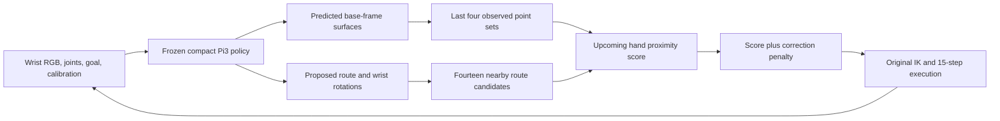

# GTSN: Preserve the Route, Correct the Clearance

## Research story

**Central idea: a monocular policy can know where to go while still needing help
with how closely its hand passes an obstacle. Use geometry to make a small,
explicit execution decision around the learned route.**

A learned reaching policy already captures useful behavior: going above a low
obstacle, moving around a tall one, and approaching the goal. Replacing that
behavior with a planner driven by imperfect monocular geometry can discard what
the policy does well. Conversely, feeding geometric features into a policy does
not ensure that its next motion clears an obstacle. The missing link is an
explicit comparison between the proposed motion and the surfaces the robot has
actually observed.

We propose **route-preserving clearance**. A frozen policy proposes the route.
A short memory stores RGB-predicted surfaces in the robot base frame. A local
refiner compares a small set of corrections by the clearance of the moving hand,
while penalizing departure from the proposal. Geometry has a deliberately narrow
job: rank nearby ways of executing a route, rather than construct a complete
world model or decide the whole task again.

On the fixed TSN-1k split, this implementation increases validation success from
**82% to 85%** and exploratory test success from **78% to 83%**, with no additional
learned parameters. Test collisions fall from 22 to 17 in 100 episodes. The gain
is concentrated in side routes, which improve from **52.5% to 67.5%**; over routes
fall from 92.5% to 90%, and direct routes remain at 100%. This is a modest positive
result, not uniform improvement across all route types. The paired overall
95% interval is −2 to +12 percentage points. The final design was chosen after
seeing earlier test results; the selection history is explicit below.

## Three challenges and contributions

### 1. A plausible path is not the same as a clear hand motion

A route is usually represented by the tool center. The hand extends behind that
point, so a visually plausible path can still graze a surface. Good imitation
accuracy alone does not resolve this mismatch.

**Contribution: an explicit execution query.** Evaluate the upcoming hand motion
against RGB-predicted surfaces, using three points along the hand axis and five
samples within the executed horizon. This turns descriptive geometry into a
candidate-specific clearance cost. A TCP-only control tests whether representing
the hand's extent matters in this implementation.

### 2. The camera moves, but an observed obstacle stays in the scene

With a wrist camera, the current image changes as the robot turns or approaches
an object. An obstacle leaving the view should not immediately stop influencing
the next motion.

**Contribution: a short surface memory for execution.** Keep four observed point
sets in a common base frame and query their union. The baseline already has
feature memory; the added memory preserves explicit surfaces for the clearance
calculation. A current-surface-only control isolates this distinction. This is
bounded history for static scenes, not active perception or a reconstruction of
never-observed space.

### 3. A geometric correction can damage a useful learned route

Monocular surfaces are imperfect. An aggressive move away from one predicted
surface can destroy goal progress or move the arm toward another obstacle.
Making the geometry more influential is therefore not automatically better.

**Contribution: preserve the proposal while correcting local clearance.** Search
fourteen bounded sideways/upward corrections, including the unmodified proposal.
Penalize correction magnitude, ramp corrections smoothly along the trajectory,
and fade them near the goal. A zero-penalty control tests the need to retain the
route prior. The final method uses a fixed proximity scale; our experiments do
not support making learned uncertainty inflation a claimed contribution.

These contributions form one decision: **remember relevant surfaces, check the
motion that will actually be attempted, and change the proposal only when the
clearance score compensates for the correction.** The ablations below distinguish
design motivations from demonstrated effects.

## Method



Let the frozen proposal be \(X^0=(x^0_1,\ldots,x^0_{30})\), with wrist rotations
\(Q_j\). For candidate offset \(\Delta_k\), define

\[
x^k_j=x^0_j+a_j f(d_g)\Delta_k,
\quad a_j=1.1883951\sin(j/30),
\quad f(d_g)=\operatorname{clip}((d_g-0.025)/0.055,0,1).
\]

Here distances are in meters, \(d_g\) is current TCP-to-goal distance, and
\(\Delta_0=0\). Offsets use the horizontal direction perpendicular to the goal
and the upward direction; their maximum nominal magnitude is about 6.4 cm. They do not
change the predicted wrist rotation. At sampled times \(j\in\{3,6,9,12,15\}\),
represent the hand by
\(b^k_{j,\ell}=x^k_j-Q_j e_z\ell\), for
\(\ell\in\{0,0.05,0.10\}\). With retained surfaces \(P_t\), score

\[
R_t(X^k)=\frac{1}{15}\sum_{j,\ell}\max_{p\in P_t}
 \exp\left[-\frac{\|b^k_{j,\ell}-p\|^2}{2r^2}\right],
\qquad r=0.04\text{ m}.
\]

Choose

\[
k^*=\arg\min_k\left[R_t(X^k)+
 \lambda\left(\frac{\|\Delta_k\|}{0.05\text{ m}}\right)^2\right],
\qquad \lambda=0.08.
\]

The score is a **surface-proximity heuristic**, not a probability of collision.
Because the unmodified candidate is included, the selected candidate satisfies
\(R_t(X^{k^*})+\lambda\|\Delta_{k^*}\|^2/(0.05)^2\leq R_t(X^0)\).
Thus a nonzero correction must pay for itself under the chosen score. This is
an algebraic property of candidate selection, not a guarantee about true
clearance, the IK solution, or closed-loop success. With no valid surface points,
the zero candidate is selected; within 2.5 cm of the goal all corrections vanish.

The backbone predicts dense coordinates already expressed in the base frame.
Each observation contributes a nearest-neighbor sample of 20×20 points. Workspace
filtering retains \(0.10<x<1.05\), \(|y|<0.60\), and \(0.04<z<0.65\).
Points within 7 cm of the measured TCP are excluded as an approximate self mask.
The four-set buffer resets between episodes and contains at most 1,600 points.
This specifically targets raised tabletop obstacles; it cannot certify table,
forearm, finger-width, or whole-scene clearance.

The policy receives live wrist RGB, joints, goal, and camera calibration. No
measured depth, simulator object pose, route label, collision oracle, or expert
future enters the deployed policy. Depth and expert trajectories supervised the
existing frozen model during training. The original six-knot route head,
inverse kinematics, 30-target prediction, fifteen-step execution, and terminal
servo remain in use.

## What distinguishes this study

The research contribution is a specific formulation and empirical design result:
**local correction of a frozen reaching policy using remembered monocular surfaces
and a swept-hand query, with an explicit cost for overruling the proposal.**
It adds no trainable weights and reuses the backbone's geometry output. The
combination is the proposed contribution; memory, geometric planning, and policy
correction are not individually new inventions.

The closest broad idea already exists in
[CARE](https://arxiv.org/abs/2506.03834), which uses monocular depth and repulsive
trajectory adjustment for mobile visual navigation. Our implementation addresses
wrist-camera reaching through a 3D hand query, remembered surfaces, and a bounded
candidate objective. [Neural MP](https://arxiv.org/abs/2409.05864) also combines
learned motion with geometric refinement. We therefore do not claim the first
visual-policy correction or the first neural/geometric planner.

[RAIL](https://rail2024.github.io/) studies reachability-based enforcement of hard
constraints on imitation policies. Our noisy surface score has no corresponding
safety guarantee. [MonoMPC](https://arxiv.org/abs/2508.07387) learns distributions
of action-conditioned clearance for monocular navigation; our fixed score needs
no additional collision-model training, but also lacks that learned calibration.
These are related formulations, not baselines that we have reproduced.

The visual backbone builds on [Pi3](https://arxiv.org/abs/2507.13347).
[Act3D](https://arxiv.org/abs/2306.17817) and
[STARRY](https://arxiv.org/abs/2604.26848) already connect geometric representations
to manipulation actions; [scene-graph memory](https://arxiv.org/abs/2606.01072)
already supplies explicit history for partially observed imitation learning.
The new experiment asks how explicit geometry should constrain an already
capable proposal, not whether geometry or memory can be useful in general.

## Experiments

### Protocol and selection history

TSN-1k contains 1,000 episodes: 200 direct, 400 over, and 400 side routes. We retain
the checkpoint's fixed 800/100/100 train/validation/test split, with route counts
160/320/320 for training and 20/40/40 for each evaluation split. A rollout succeeds
when the TCP reaches within 1 cm of the goal without collision. Collision ends
the episode; the control-step limit is 400. This primary metric is XYZ reaching,
not full-pose success. Physics, collision rules, horizon, servo, and split are
identical across conditions.

The reference is
`/run/user/1016/experiments/gtsn_simplification_20261003/simplified.pt`.
The baseline replay reproduces all 100 historical validation joint trajectories,
TCP trajectories, predicted targets, and outcomes bitwise. Its SHA-256 is
`fa3d77a605426da18d4bbb15a7bc982f3b1c9487b60d3e6fbc897850bf4f000b`.

There are two distinct selection stages, which must not be conflated:

1. The initial study chose an uncertainty-inflated refiner on validation:
   correction penalties 0.03/0.08/0.15 obtained 81/86/81% success. The frozen
   choice obtained 79% test success, versus the baseline's 78%.
2. Its fixed-margin ablation obtained 85% validation and 83% test success. The
   present story adopts this simpler design **after inspecting those results**.
   We froze three additional matched controls before their new rollouts, with
   no subsequent parameter search. Previously completed baseline/method runs
   are reused explicitly, rather than counted as new evaluations.

The original test split had also been inspected in earlier project work.
Consequently, the reported gains are exploratory benchmark evidence. Repeated
rollouts of these same episodes do not increase the number of independent test
scenes. All conditions and negative experiments remain reported.

### Main result

| Method | Validation success | Test success | Test collision | Test direct / over / side |
|---|---:|---:|---:|---|
| Compact baseline | 82% | 78% | 22% | 100 / 92.5 / 52.5% |
| **Route-preserving clearance, fixed 4 cm scale** | **85%** | **83%** | **17%** | **100 / 90 / 67.5%** |
| Initial validation-selected uncertainty inflation | 86% | 79% | 21% | 100 / 90 / 57.5% |
| Constant training-derived 4.3872 cm scale | 86% | 81% | 19% | 100 / 90 / 62.5% |

Against the baseline, the fixed-margin method gains nine test episodes and loses
four: **+5 percentage points**, paired route-stratified bootstrap 95% interval
**[−2, +12]**, exact McNemar p=0.267. These numbers are compatible with a useful
small gain, but the interval includes zero. Full XYZ-and-orientation success is
31%, versus 28% for the baseline. No claim of 83% full-pose success is intended.
Intervals use 20,000 paired bootstrap resamples within route strata. McNemar
p-values are exploratory and uncorrected for multiple comparisons.

On test, the method applies a nonzero correction at 61.3% of 1,064 observations.
The mean nominal correction, including zero choices and goal fading, is 1.48 cm;
the executed-horizon ramp makes the actual early waypoint shifts smaller. This
measures how the method intervenes, rather than attributing all successful
rollouts to its corrections.

### Matched controls for the revised story

All **600 additional rollouts are complete**: three controls on all 100 validation
and 100 test episodes each. Every control uses the same fixed 4 cm score and zero
uncertainty inflation. The baseline and full-method rows reuse completed runs.

| Condition | Validation success | Test success | Test collision / timeout | Test direct / over / side |
|---|---:|---:|---:|---|
| Compact baseline | 82% | 78% | 22 / 0% | 100 / 92.5 / 52.5% |
| **Route-preserving clearance** | **85%** | **83%** | **17 / 0%** | **100 / 90 / 67.5%** |
| Without surface memory | 75% | 81% | 19 / 0% | 100 / 92.5 / 60% |
| Without hand extent: TCP only | 85% | 77% | 22 / 1% | 100 / 92.5 / 50% |
| Without correction penalty | 83% | 82% | 17 / 1% | 100 / 95 / 60% |

| Full method minus control | Validation gain | Test gain [paired 95% interval] | Test gained / lost episodes |
|---|---:|---:|---:|
| Without surface memory | +10 pp | +2 pp [−3, +7] | 4 / 2 |
| Without hand extent | 0 pp | +6 pp [0, +13] | 9 / 3 |
| Without correction penalty | +2 pp | +1 pp [−6, +8] | 7 / 6 |

The comparison supports a coherent design, with different levels of evidence.
Surface memory improves both splits, especially validation (+10 pp, interval
[+4, +17]). Hand extent makes no aggregate validation difference but improves
test by six points, principally on side routes. The correction penalty has a
small success benefit on both splits and reduces timeouts. Test McNemar p-values
for these three component comparisons are 0.688, 0.146, and 1.0, respectively;
they do not establish statistically decisive independent component benefits.
The penalty is a useful restraint in the observed runs, not the source of a
large success gain. Its over-route tradeoff also remains visible: the zero-penalty
control scores 95% there, versus the full method's 90%.


The prewritten protocol, immutable rollout source snapshot, complete statistics,
and PDF versions of these figures are in
`/run/user/1016/experiments/gtsn_route_preserving_20261003/`.

The validation diagnostics clarify what the controls change. Removing memory
reduces mean retained surface points from 254 to 54. Removing the correction
penalty increases the mean nominal correction from 1.44 cm to 4.51 cm, increases
mean control steps from 150.44 to 166.63 across all rollouts, and produces two
timeouts instead of zero. The latter comparison retains the same bounded
candidate set and goal fade: it tests the penalty, not unrestricted replanning.

### What the unsuccessful experiments taught us

| Attempt | Completed experiment | Outcome and interpretation |
|---|---|---|
| Learned route-evidence retrieval | Five variants × 15 training epochs | All selected unchanged epoch zero by validation waypoint RMSE, 15.821 mm. This attempt did not improve the proposal. |
| Uncertainty inflation | Matched validation/test comparison | 86/79% versus fixed-margin 85/83%. The pooled-coordinate uncertainty did not yield a better test clearance decision. |
| Intervention thresholds | Four × 100 validation rollouts | Full-score thresholds 0.15/0.30/0.45: 85/80/78%; deterministic threshold 0.30: 80%. No improvement over the retained first-round 86% validation result; no new test runs. |
| Realized arm-body scoring after IK | Two × 100 validation rollouts | Penalties 0.08/0.15: 85/83%; no improvement over that reference. Neither alternative posture candidate was selected. No new test runs. |

The learned retrieval variants use matched expert/recovery sampling, route
sampling, optimizer, cached observations, and seed. Their failure does not prove
that learned geometric representations cannot work; it motivates trying an
explicit execution decision in this particular setting. Similarly, failure of
uncertainty inflation is not a general argument against uncertainty modeling.
The tested uncertainty describes pooled coordinates, not the distribution of
realized collision outcomes.

## Reproduction and artifacts

The implementation is `src/tsn/models/clearance_policy.py`. The final method uses
`mode=deterministic`, `margin=0.04`, and `penalty=0.08`; uncertainty is ignored in
this mode. Evaluate it with the original frozen checkpoint:

```bash
python3 scripts/docker_run.py --gpu 0 evaluate \
  --checkpoint /run/user/1016/experiments/gtsn_simplification_20261003/simplified.pt \
  --partition test --clearance-mode deterministic \
  --clearance-margin .04 --clearance-uncertainty 0 --clearance-penalty .08 \
  --output-dir /run/user/1016/experiments/route-preserving-replay
```

Use a fresh output directory. Omit the clearance flags to run the baseline.
For the matched controls, use `--clearance-mode current` or `tcp`, always with
`--clearance-uncertainty 0`; use deterministic mode with
`--clearance-penalty 0` to remove the correction penalty. Proposal-feature memory
remains present in every condition.

```bash
python3 scripts/run_route_preserving_study.py \
  --root /run/user/1016/experiments/route-preserving-reproduction \
  --gpus 0,1,2,3,4
python3 scripts/docker_run.py test
```

The follow-up launcher reuses the completed baseline/method references, writes
its protocol before evaluation, saves a source snapshot, runs 600 new control
rollouts, and generates paired statistics and PNG/PDF figures. To recompute the
original method runs and first-round selection, use
`scripts/run_clearance_study.py --root <fresh-directory> --gpus 0,1,2,3,4`.
All numerical work runs in the existing project Docker image; no host packages
or unrelated images are modified.

The initial archive is
`/run/user/1016/experiments/gtsn_research_20261003/`, also linked from `runs/`.
It contains all five training histories, 2,000 original rollouts, calibration,
bitwise replay audits, source snapshots, and the earlier research narrative.
The new archive is
`/run/user/1016/experiments/gtsn_route_preserving_20261003/`.
Each rollout contains trajectories, outcomes, settings, and correction diagnostics.
The cumulative work comprises **75 training epochs, 2,600 rollouts (1,700 validation
and 900 test), and 31 passing regression tests**. Rollout counts include multiple
conditions on the fixed episodes; they are not counts of independent scenes.
Paired figures choose the first gained and first lost episode by ID; ground-truth
main-obstacle envelopes appear only in offline illustrations, never in policy inputs.

## Scope of the conclusion

This study supports route-preserving clearance as a simple, implemented way to
improve the observed failure profile of the specified monocular reaching policy.
The substantive research question is how much authority imperfect geometry
should have over a good learned route. The fixed-margin result favors using it
for a bounded local decision; making the geometric machinery more elaborate did
not automatically improve outcomes.

Evidence is limited to one trained backbone and static simulated tabletop scenes.
The method does not provide full-arm collision guarantees, active viewpoints,
dynamic-scene mapping, real-camera validation, or a comparison against every
external planner. A fresh scene set and independent training seeds would test
whether the observed gain generalizes. Those are extensions of this completed
benchmark study, not results claimed here.
